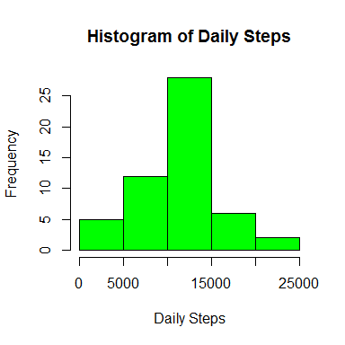
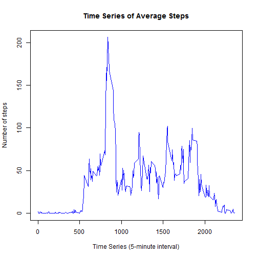
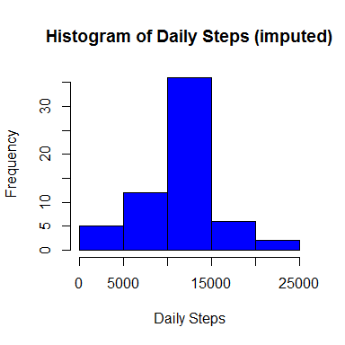
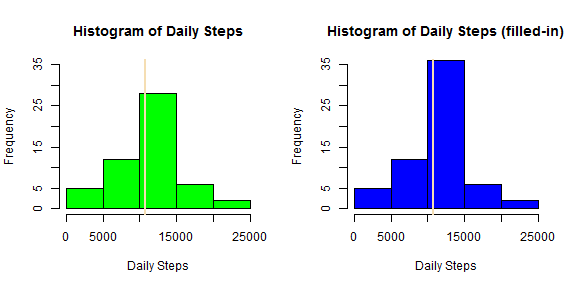
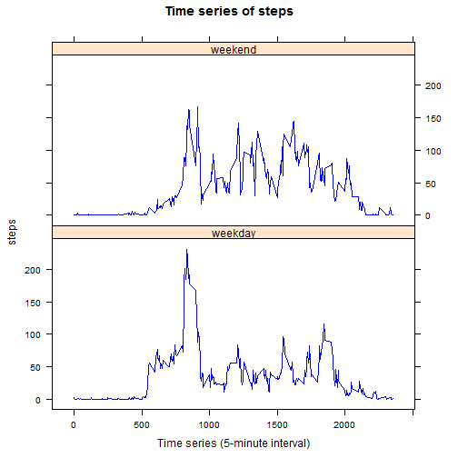

```r
library(dplyr, quietly = TRUE)
library(data.table, quietly = TRUE)
library(lattice, quietly = TRUE)
```

## Loading and preprocessing the data  
  
 
###1. Loading the data  


```r
fpath <- "activity.csv"

if (!file.exists(fpath)) {
        if (!file.exists("activity.zip")) {
        library(downloader, quietly = TRUE)
        download(url, "activity.zip")
        }
        unzip("activity.zip", files = "activity.csv")
}
df <- fread(fpath)
```
  
  
###2. Transforming the data  


```r
df <- df %>%
        tbl_df() %>%
        mutate(date = as.Date(date))
```


## What is mean total number of steps taken per day?  

Note: For this part of the assignment, you can ignore the missing values in the dataset.

###1. Calculating the total number of steps taken per day  


```r
daily <- df %>%
         filter(!is.na(steps)) %>%
         group_by(date) %>%
         summarise(steps = sum(steps))
```

###2. Histogram of the total number of steps taken each day  


```r
hist(daily$steps, col = "green", main = "Histogram of Daily Steps",
xlab = "Daily Steps")
```

 

###3. Calculating and reporting the mean and median of the total number of steps taken per day  


```r
mean_daily <- mean(daily$steps, na.rm = TRUE)
median_daily <- median(daily$steps, na.rm = TRUE)
```
####Answer: 
####The mean total number of daily steps is **10766**. The median of the total number of daily steps is **10765**.  
   
   
## What is the average daily activity pattern?
  
###1. Making a time series plot of the 5-minute interval and the average number of steps taken, averaged across all days.  


```r
ts <- df %>% 
        group_by(interval) %>% 
        summarise(steps = mean(steps, na.rm = TRUE))
```


```r
with(ts, 
     plot(interval, steps, type = "l", lwd = 1, col = "blue", 
          main = "Time Series of Average Steps", 
          xlab = "Time Series (5-minute interval)", 
          ylab = "Number of steps")
     )
```

 
    
###2. Which 5-minute interval, on average across all the days in the dataset, contains the maximum number of steps?  


```r
max_ind <- which(ts$steps == max(ts$steps, na.rm = TRUE))
interval_max <- ts$interval[max_ind]
```
  
####Answer: The 5-minute interval **835** contains the maximum number of steps, on average across all the days in the dataset.    
   
   
## Imputing missing values  

###1. Calculating and reporting the total number of missing values in the dataset (i.e. the total number of rows with NAs)  


```r
n_NA <- df %>%
        filter(is.na(steps)) %>%
        nrow()
```

#### Answer: The total number of missing values in the dataset is **2304**.  
  
  
###2. Devising a strategy for filling in all of the missing values in the dataset.   
####Strategy of filling: using the mean for that 5-minute interval  


```r
ind_NA <- which(is.na(df$steps))
interval_NA <- df$interval[ind_NA]
```
   
###3. Creating a new dataset that is equal to the original dataset but with the missing data filled in.  


```r
fill <- df
for (i in ind_NA) {
        fill$steps[i] <- ts$steps[which(ts$interval == df$interval[i])]
}  
```
  
###4. Make a histogram of the total number of steps taken each day and Calculate and report the mean and median total number of steps taken per day. Do these values differ from the estimates from the first part of the assignment? What is the impact of imputing missing data on the estimates of the total daily number of steps?  

####    1). Making histogram of the total number of steps taken each day.  


```r
daily_fill <- fill %>%
                group_by(date) %>%
                summarise(steps = sum(steps))
```

```r
hist(daily_fill$steps, col = "blue", main = "Histogram of Daily Steps (imputed)",
xlab = "Daily Steps")
```

 

####    2). Calculating and reporting the mean and median total number of steps taken per day  


```r
mean_daily_fill <- mean(daily_fill$steps, na.rm = T)
median_daily_fill <- median(daily_fill$steps, na.rm = T)
```

####Answer: The mean and median of the total number of daily steps are 
**10766** and **10766**.  
  
####    3). Do these values differ from the estimates from the first part of the assignment? 

```r
identical(mean_daily, mean_daily_fill)
```

```
## [1] TRUE
```

```r
all.equal(median_daily, median_daily_fill, tolerance = 0.0002)
```

```
## [1] TRUE
```
  
####Answer: The mean and median values of the total number of steps taken per day are same before and after imputing for the missing data.  
  
####    4). What is the impact of imputing missing data on the estimates of the total daily number of steps?  
  
####Answer: The impact of imputing missing data on the estimates of the total daily number of steps is that it increases the frequencies, here the number of observations or number of days for some range of the average daily steps. The following side by side 2-panel histograms show that the number of days for the daily steps between 10000 and 15000 is increased significantly.  


```r
par(mfrow = c(1,2))
 
hist(daily$steps, ylim = c(0, 35), col = "green", main = "Histogram of Daily Steps", xlab = "Daily Steps")
abline(v = median_daily, lwd = 2, col = "wheat")

hist(daily_fill$steps, ylim = c(0, 35), col = "blue", main = "Histogram of Daily Steps (filled-in)", xlab = "Daily Steps")
abline(v = median_daily, lwd = 2, col = "wheat")
```

 
   
      
   
## Are there differences in activity patterns between weekdays and weekends?

###1. Creating a new factor variable in the dataset with two levels – “weekday” and “weekend” indicating whether a given date is a weekday or weekend day.  


```r
weekde <- c(1:nrow(df))
weekde[] <- "weekday"

ind1 <- which(weekdays(fill$date, abbreviate = TRUE) %in% c("Sat", "Sun"))
weekde[ind1] <- "weekend"

fill <- mutate(fill, weekde = factor(weekde))
```
   
###2. Making a panel plot containing a time series plot of the 5-minute interval and the average number of steps taken, averaged across all weekday days or weekend days.  


```r
ts_fill <- fill %>%
                group_by(interval, weekde) %>%
                summarise(steps = mean(steps, na.rm = T))
```

```r
xyplot(steps ~ interval | weekde, data = ts_fill, type = "l", col = "blue", layout = c(1, 2), main = "Time series of steps", xlab = "Time series (5-minute interval)")
```

 

